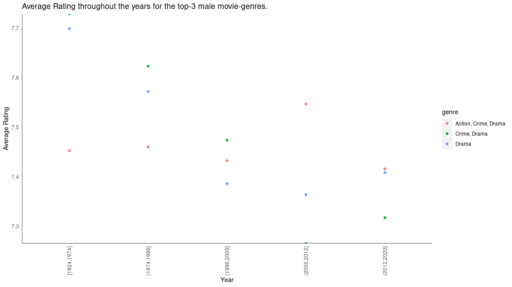
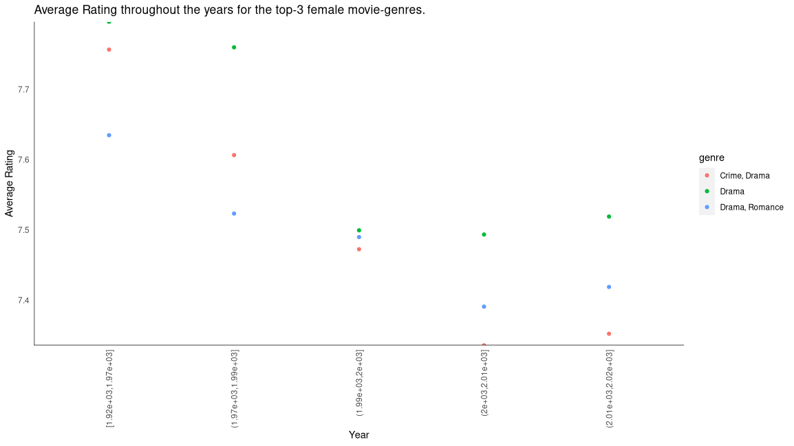

```{r setup, include=FALSE}
knitr::opts_chunk$set(echo = TRUE, fig.width = 12.025, fig.height = 6.7653)
```

CS 625, Fall 2020

Due: Friday, December 11, 2020 by 11:59pm

## Goal

The goal of this assignment is to use data journalism/storytelling techniques to refine a chart from HW7.

## EDA Process summary

For this particular EDA we used the **IMDb_movies.csv** and **IMDd_ratings.csv** of the [IMDb movies extensive dataset](https://www.kaggle.com/stefanoleone992/imdb-extensive-dataset) dataset. This dataset includes for various information about movies on IMDB throughout the years.

From homework 7 we understood that the most successful and well rated movie-genres, where successful means more than 2721.4 votes and well rated means at least a 6.9 rating, are:

For men:
1. **Crime, Drama**
1. **Drama**
1. **Action, Crime, Drama**

For women are:
1. **Drama**
1. **Crime, Drama**
1. **Drama, Romance**

Since we had these results, we created 2 charts for each gender to explore the following question:

**How the average rating of the most successful and well rated genres for each gender has changed throughout the years?**

## Homework 7 visualization




## Homework 8 visualization

```{r}
library(tidyverse)
library(ggplot2)
library(grid)
library(ggthemes)

df1 <- data.frame(read.csv("./data/IMDb_movies.csv"))
df2 <- data.frame(read.csv("./data/IMDb_ratings.csv"))
df <- merge(df1, df2, by = "imdb_title_id")

# remove this entry
df <- subset(df, df$year != "TV Movie 2019")

# make year numeric
df$year <- as.numeric(df$year)

# extract subset of successful and famous movies
df <- subset(df, df$avg_vote >= 6.9 & df$votes >= 2721.4)

# keep movies from 1930 and after in order to cover both genders favorite genres and create equal time segments
df <- subset(df, df$year >= 1930)

# create lists that will help in the presentation of data every 15 years
fifteen_years_starting_year <- c(1930, 1945, 1960, 1975, 1990, 2005)
fifteen_years_labels <- c("1930-1945", "1946-1960", "1961-1975", "1976-1990", "1991-2005", "2006-2020")
df$year_bin <- as.numeric(as.character(cut(df$year, breaks = c(1929, 1945, 1960, 1975, 1990, 2005, 2020), labels = fifteen_years_starting_year)))

# male results
df_males <- subset(df, df$genre == "Crime, Drama" |
  df$genre == "Drama" |
  df$genre == "Action, Crime, Drama")

df_males <- df_males %>%
  group_by(year_bin, genre) %>%
  summarize(avg_rating = mean(males_allages_avg_vote))
df_males$gender <- "Men"

# female results
df_females <- subset(df, df$genre == "Drama" |
  df$genre == "Crime, Drama" |
  df$genre == "Drama, Romance")

df_females <- df_females %>%
  group_by(year_bin, genre) %>%
  summarize(avg_rating = mean(females_allages_avg_vote))
df_females$gender <- "Women"

# combination
df <- rbind(df_males, df_females) %>%
  arrange(year_bin) %>%
  rename(Genre = genre)
df$gender <- factor(df$gender, levels = c("Men", "Women"))

# create column to identify which lines are going to be highlighted
df <- df %>% mutate(Highlight = (gender == "Men" & Genre == "Action, Crime, Drama") | (gender == "Women" & Genre == "Drama"))

gender_colours <- c("#f0aed4", "#d6eefa")

plot <- ggplot(df, aes(x = year_bin, y = avg_rating, color = Genre, size = Highlight)) +
  geom_line() +
  facet_wrap(~gender, nrow = 2) +
  labs(title = "For Men, after 1975, the Action, Crime, Drama genre slowly increased and recently became the most well-rated genre.\nFor Women, after 1960, the Drama genre become the most well-rated genre.",
       subtitle = "Average rating per 15 years for the-3 most successful and well-rated movie genres of each gender",
       caption = "Source: IMDb movies extensive dataset | Kaggle",
       x = "Year",
       y = "Average Rating") +
  geom_hline(aes(yintercept = -Inf), color = "black") +
  geom_vline(aes(xintercept = -Inf), color = "black") +
  scale_size_manual(values = c("TRUE" = 2, "FALSE" = 0.5)) +
  scale_color_tableau() +
  scale_y_continuous(expand = c(0, 0)) +
  scale_x_continuous(breaks = fifteen_years_starting_year, labels = fifteen_years_labels) +
  guides(size = FALSE) +
  theme(panel.background = element_blank(), axis.ticks.x = element_blank(), axis.ticks.y = element_blank(),
        axis.title = element_text(size = 13), axis.text = element_text(size = 11), plot.subtitle = element_text(color = "grey29"),
        legend.text = element_text(size = 11), legend.title = element_text(size = 13),
        strip.background = element_rect(colour = "black", fill = "black"), strip.text.x = element_text(size = 14))

#   set color of strip.text for each facet
g <- ggplot_gtable(ggplot_build(plot))
strip_both <- which(grepl('strip-', g$layout$name))
k <- 1
for (i in strip_both) {
  j <- which(grepl("text", g$grobs[[i]]$grobs[[1]]$childrenOrder))
  g$grobs[[i]]$grobs[[1]]$children[[j]]$children[[1]]$
    gp$
    col <- gender_colours[k]
  k <- k + 1
}
grid.draw(g)
```

### Explanation of how the final chart answer the question I asked in HW7

The question that we asked in HW7 was:

**How the average rating of the most successful and well rated genres for each gender has changed throughout the years?**

As we can see from the above chart, the most interesting observations for each gender are that:

1. For Men, after 1975, the Action, Crime, Drama genre slowly increased and recently became the most well-rated genre.

1. For Women, after 1960, the Drama genre is the most well-rated genre.

The title of the above chart reflects these exact two statements and answers our question by highlighting the most interesting observations.

### Description of all design decisions made in transforming from the draft chart to the refined one along with the used visualization principles

As we can from the draft charts, and the final chart there are a couple of differences that were performed in order to refine our final chart.

1. Firstly, we combined the two gender-based charts into one for easy comparisons, therefore we used the **small multiple** visualization principle for partitioning our data based on the gender since we have the same *encoding*, i.e. year-segment and average rating.

1. Instead of using cut, which cuts the years in a specified number of time segments equally based on the amount of movies for each time segment, we split the time frame every 15 years, and start the counting from 1930 in order to have equal time segments.

1. Another notable difference is the fact that we changed our **chart idiom** from **scatter-plot** to a **multiple line chart** which is using the **line mark**. This line mark is using the **channel** of **position on common scale** which helps in visualizing the trend of the average rating of every genre for each gender. In order to use the line chart idiom, we used the 15 years time intervals as a **Quantitative attribute**.

1. The x-axis and y-axis ranges are the same across both charts for easy comparisons.

1. The color palette that we used for male and female are from *NYT, 2017: “The Words Men and Women Use When They Write About Love”*, and they were found from [An alternative to pink & blue: Colors for gender data](https://blog.datawrapper.de/gendercolor/). The black background helped in making those light colours visible.

1. We used a grey color for the subtitle of the chart since it's not the major thing that the viewer should look at, the title is.

1. The colour palette that we used for the colors of the lines is the default of **Tableau** which is using the **channel** of **color hue** to distinguish each trend line of every genre.

1. We chose to have a facet_wrap with 2 rows in order to easily compare the differences between each gender every 15 years.

1. Since we have a facet_wrap with 2 rows, the best place for the legend of our chart is on the right since it's easy to look for the color of each line this way for both gender charts.

1. Lastly, we used the **pop-out** principle to highlight the two major observations that the title describes.


## References

1. [IMDb movies extensive dataset](https://www.kaggle.com/stefanoleone992/imdb-extensive-dataset)

1. [Subtitles and captions with ggplot2 v.2.2.0](https://www.r-bloggers.com/2016/11/subtitles-and-captions-with-ggplot2-v-2-2-0/)

1. [Increase number of axis ticks](https://stackoverflow.com/questions/11335836/increase-number-of-axis-ticks)

1. [Is there a way to change a continuous axis' labels to be strings in ggplot?](https://stackoverflow.com/questions/62866078/is-there-a-way-to-change-a-continuous-axis-labels-to-be-strings-in-ggplot)

1. [How does cut with breaks work in R](https://stackoverflow.com/questions/39123458/how-does-cut-with-breaks-work-in-r)

1. [How to change the value of a variable using R programming in a data frame?](https://www.edureka.co/community/35430/how-change-the-value-variable-using-programming-data-frame)

1. [Adding a column to data.frame and fill that column with a particular string using R](https://stackoverflow.com/questions/34429001/adding-a-column-to-data-frame-and-fill-that-column-with-a-particular-string-usin)

1. [Combine two data frames with the same column names](https://stackoverflow.com/questions/20081256/combine-two-data-frames-with-the-same-column-names/20081325)

1. [Changing line width of some lines out of a group of multiple lines using ggplot2](https://stackoverflow.com/questions/48819333/changing-line-width-of-some-lines-out-of-a-group-of-multiple-lines-using-ggplot2)

1. [How to Remove Legend from a GGPlot](https://www.datanovia.com/en/blog/how-to-remove-legend-from-a-ggplot/)